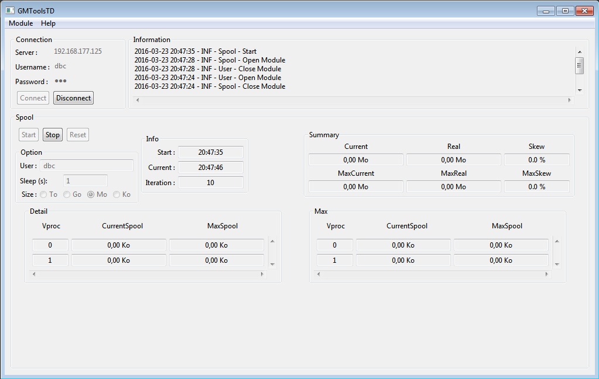
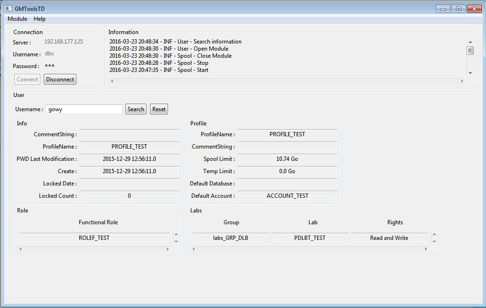
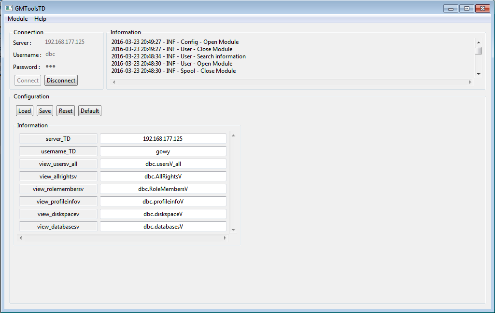

# GMToolsTD

This ToolBox is used to have more information about Spool usage and user status.

## Execution

JDK Used : `jdk1.7.0_79`

## Usage







## Test Environment

Configuration to create a test environment with a Teradata VM :
```SQL
-- Creation d'un environnement de test :

CREATE PROFILE PROFILE_TEST as 
	account = 'ACCOUNT_TEST'
	,default database = null
	,SPOOL = 10737418240
	,TEMPORARY = 0
	;
	

-- creation de l'arboresence SYSDBA/GMA/PGMAPGMA/PGMAPGMAB/PGMAPGMAB_SOC
CREATE USER "SYSDBA" FROM "dbc" AS
	PASSWORD  =  "SYSDBA",
	PERMANENT = 10737418240,
	SPOOL = 10737418240,
	TEMPORARY = 0,
	DEFAULT DATABASE  =  "DBC",
	ACCOUNT = 'SYSDBA',
	NO FALLBACK,
	NO BEFORE JOURNAL,
	NO AFTER JOURNAL,
	TIME ZONE  =  NULL,
	DEFAULT ROLE  =  ALL;

	
CREATE DATABASE "GMA" FROM "SYSDBA" AS
	PERMANENT = 10737418240,
	SPOOL = 10737418240,
	TEMPORARY = 0,
	NO FALLBACK,
	NO BEFORE JOURNAL,
	NO AFTER JOURNAL;


CREATE USER "PGMAPGMA" FROM "GMA" AS
	PASSWORD  =  "PGMAPGMA",
	PERMANENT = 10737418240,
	SPOOL = 10737418240,
	TEMPORARY = 0,
	DEFAULT DATABASE  =  "PGMAPGMA",
	ACCOUNT = 'PGMAPGMA',
	NO FALLBACK,
	NO BEFORE JOURNAL,
	NO AFTER JOURNAL,
	TIME ZONE  =  NULL,
	DEFAULT ROLE  =  ALL;	
	

CREATE DATABASE "PGMAPGMAB" FROM "PGMAPGMA" AS
	PERMANENT = 10737418240,
	SPOOL = 10737418240,
	TEMPORARY = 0,
	NO FALLBACK,
	NO BEFORE JOURNAL,
	NO AFTER JOURNAL;	
	
CREATE DATABASE "PGMAPGMAB_SOB" FROM "PGMAPGMAB" AS
	PERMANENT = 10737418240,
	SPOOL = 10737418240,
	TEMPORARY = 0,
	NO FALLBACK,
	NO BEFORE JOURNAL,
	NO AFTER JOURNAL;	

	
-- Creation de l'arboresence SYSDBA/DLB/labs_GRP_DLB/PDLBT_TEST
MODIFY USER "SYSDBA" AS 
	PERMANENT = 10737418240;
	
CREATE DATABASE "DLB" FROM "SYSDBA" AS
	PERMANENT = 10737418240,
	SPOOL = 10737418240,
	TEMPORARY = 0,
	NO FALLBACK,
	NO BEFORE JOURNAL,
	NO AFTER JOURNAL;
	
CREATE USER "labs_GRP_DLB" FROM "DLB" AS
	PASSWORD  =  "labs_GRP_DLB",
	PERMANENT = 10737418240,
	SPOOL = 10737418240,
	TEMPORARY = 0,
	DEFAULT DATABASE  =  "labs_GRP_DLB",
	ACCOUNT = 'labs_GRP_DLB',
	NO FALLBACK,
	NO BEFORE JOURNAL,
	NO AFTER JOURNAL,
	TIME ZONE  =  NULL,
	DEFAULT ROLE  =  ALL;	
	
CREATE DATABASE "PDLBT_TEST" FROM "labs_GRP_DLB" AS
	PERMANENT = 10737418240,
	SPOOL = 10737418240,
	TEMPORARY = 0,
	NO FALLBACK,
	NO BEFORE JOURNAL,
	NO AFTER JOURNAL;	
	
	
-- création d'un role fonctionnel donnant les droits sur le role technique créé au dessus
CREATE ROLE ROLET_TEST;

-- création d'un user GMAT avec le role fonctionnel
CREATE ROLE ROLE_TEST ;

grant SELECT, INSERT, UPDATE, DELETE ,  DROP table, CREATE table on PGMAPGMAB_SOB to ROLET_TEST ;
grant ROLET_TEST to ROLEF_TEST;


CREATE USER "gowy" FROM "DBC" AS
	PASSWORD  =  "gowy",
	PERMANENT = 0,
	SPOOL = 10737418240,
	TEMPORARY = 0,
	DEFAULT DATABASE  =  "gowy",
	ACCOUNT = 'gowy',
	NO FALLBACK,
	NO BEFORE JOURNAL,
	NO AFTER JOURNAL,
	TIME ZONE  =  NULL,
	DEFAULT ROLE  =  ALL,
	PROFILE  =  "PROFILE_TEST";	

-- donner les droits directs sur la base LAB_01 au user GMAT
grant ROLEF_TEST to gowy;
grant SELECT, INSERT, UPDATE, DELETE ,  DROP table, CREATE table on PDLBT_TEST to gowy;

grant SELECT on dbc.usersv_all to gowy;

-- creation vue dbc.usersV_all
CREATE	VIEW DBC.UsersV_All
AS 
SELECT	
   dbase.DatabaseName  (NAMED UserName),
   dbase.CreatorName  (NAMED CreatorName),
   CAST(dbase.PasswordModTime AS DATE) as PasswordLastModDate,
   CAST(dbase.PasswordModTime AS TIME(0)) as PasswordLastModTime,
   dbase.OwnerName  (NAMED OwnerName),
   dbase.PermSpace(FORMAT '-,---,---,---,---,---,---,--9'),
   coalesce(PF.SpoolSpace, dbase.SpoolSpace)(FORMAT '-,---,---,---,---,---,---,--9')
   (NAMED SpoolSpace),
   coalesce(PF.TempSpace, dbase.TempSpace)(FORMAT '-,---,---,---,---,---,---,--9')
   (NAMED TempSpace),
   dbase.ProtectionType,
   dbase.JournalFlag,
   dbase.StartupString,
   coalesce(PF.DefaultAccount,dbase.AccountName ) (named DefaultAccount),
   coalesce(PF.DefaultDataBase,dbase.DefaultDataBase ) (named DefaultDataBase),
   dbase.CommentString,
   dbase.DefaultCollation,
   /*+-----------------------------------------------------+
     | PasswordChgDate converted from Julian to YY/MM/DD   |
     +-----------------------------------------------------+ */
   case 
	when	DBASE.PasswordChgDate < 0
   then null
   else
   (((100 * ((4 * nullifzero(DBASE.PasswordChgDate) - 1) / 146097)
   + (4 * (((4 * DBASE.PasswordChgDate - 1) MOD 146097) / 4)
   + 3) / 1461 - 1900) + ((5 * (((4 * (((4 * DBASE.PasswordChgDate
   - 1) MOD 146097) / 4) + 3) MOD 1461 + 4) / 4) - 3) / 153 + 2)
   / 12) * 10000 + (((5 * (((4 * (((4 * DBASE.PasswordChgDate - 1)
   MOD 146097) / 4) + 3) MOD 1461 + 4) / 4) - 3) / 153 + 2) MOD 12
   + 1) * 100 + ((5 * (((4 * (((4 * DBASE.PasswordChgDate - 1) MOD
   146097) / 4) + 3) MOD 1461 + 4) / 4) - 3) MOD 153 +5) / 5
   (date, format 'yy/mm/dd'))
   end as PasswordChgDate,
   /*+------------------------------------------------+
     | LockedDate converted from Julian to YY/MM/DD   |
     +------------------------------------------------+ */
   ((100 * ((4 * DBASE.LockedDate - 1) / 146097)
   + (4 * (((4 * DBASE.LockedDate - 1) MOD 146097) / 4)
   + 3) / 1461 - 1900) + ((5 * (((4 * (((4 * DBASE.LockedDate
   - 1) MOD 146097) / 4) + 3) MOD 1461 + 4) / 4) - 3) / 153 + 2)
   / 12) * 10000 + (((5 * (((4 * (((4 * DBASE.LockedDate - 1)
   MOD 146097) / 4) + 3) MOD 1461 + 4) / 4) - 3) / 153 + 2) MOD 12
   + 1) * 100 + ((5 * (((4 * (((4 * DBASE.LockedDate - 1) MOD
   146097) / 4) + 3) MOD 1461 + 4) / 4) - 3) MOD 153 +5) / 5
   (date, format 'yy/mm/dd', Named LockedDate),
   /*+------------------------------------------------+
     | Lockedtime converted from minutes to HH:MM     |
     +------------------------------------------------+*/
   (Dbase.LockedTime / 60 ) * 100 +
   ( Dbase.LockedTime MOD 60)
   (Integer, format '99:99',
   Named LockedTime ),
   dbase.LockedCount,
   dbase.TimeZoneHour,
   dbase.TimeZoneMinute,
   dbase.DefaultDateForm,
   dbase.CreateTimeStamp,
   DB2.DatabaseName  (named LastAlterName),
   dbase.LastAlterTimeStamp,
   dbase.DefaultCharType,
   dbase.RoleName  (NAMED RoleName),
   dbase.ProfileName  (NAMED ProfileName ),
   OU.UserAccessCnt AS AccessCount,
   OU.LastAccessTimeStamp,
   dbase.ExportDefinitionName,
   dbase.ExportWidthRuleSet
FROM	DBC.dbase
         LEFT OUTER JOIN DBC.Profiles PF
                      ON DBC.Dbase.ProfileName = PF.ProfileNameI
         LEFT OUTER JOIN DBC.Dbase DB2
                      ON DBC.dbase.LastAlterUID = DB2.DatabaseID
         LEFT OUTER JOIN DBC.ObjectUsage OU
                      ON OU.DatabaseId = DBC.Dbase.DatabaseId
                     AND OU.ObjectId IS NULL
                     AND OU.FieldId IS NULL
                     AND OU.IndexNumber IS NULL
WITH	CHECK OPTION;
```


## Changelog

v1.0 : ...

